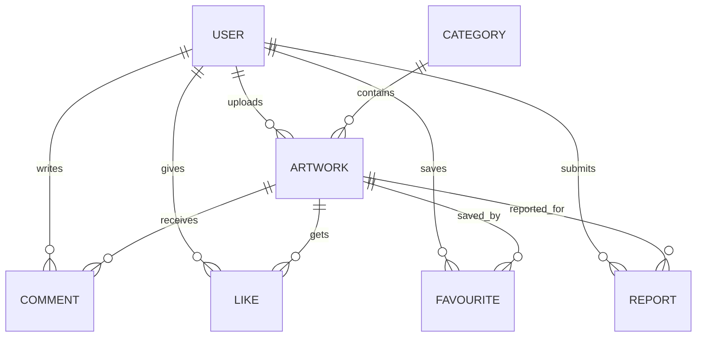

# ER Diagram

```mermaid
erDiagram
  USER ||--o{ ARTWORK : uploads
  CATEGORY ||--o{ ARTWORK : contains
  USER ||--o{ COMMENT : writes
  ARTWORK ||--o{ COMMENT : receives
  USER ||--o{ LIKE : gives
  ARTWORK ||--o{ LIKE : gets
  USER ||--o{ FAVOURITE : saves
  ARTWORK ||--o{ FAVOURITE : saved_by
  USER ||--o{ REPORT : submits
  ARTWORK ||--o{ REPORT : reported_for
```
