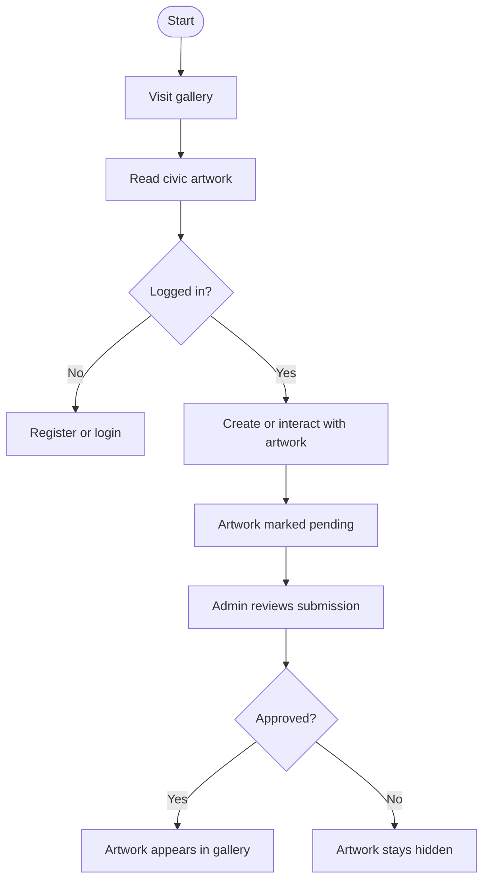

# Flowchart

```mermaid
flowchart TD
  Start([Start]) --> Browse[Visit gallery]
  Browse --> Learn[Read civic artwork]
  Learn --> Login{Logged in?}
  Login -- No --> Register[Register or login]
  Login -- Yes --> Create[Create or interact with artwork]
  Create --> Pending[Artwork marked pending]
  Pending --> Admin[Admin reviews submission]
  Admin --> Approved{Approved?}
  Approved -- Yes --> Live[Artwork appears in gallery]
  Approved -- No --> Rejected[Artwork stays hidden]
```
