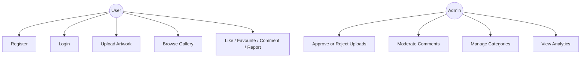

# Use Case Diagram

```mermaid
flowchart TB
  U((User))
  A((Admin))

  U --> UC1[Register]
  U --> UC2[Login]
  U --> UC3[Upload Artwork]
  U --> UC4[Browse Gallery]
  U --> UC5[Like / Favourite / Comment / Report]

  A --> AC1[Approve or Reject Uploads]
  A --> AC2[Moderate Comments]
  A --> AC3[Manage Categories]
  A --> AC4[View Analytics]
```
